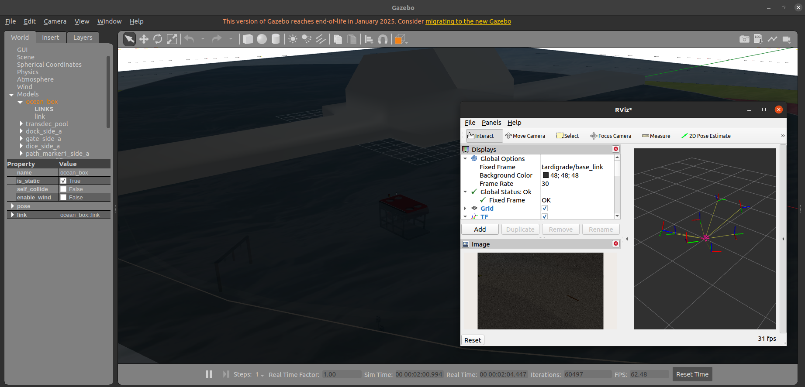

# Tardigrade Simulator
Gazebo Classic 11 simulator intended for the Tardigrade AUV. Requires ROS2 Foxy and Gazebo Classic 11 installed. Use with [tardigrade_ws](https://github.com/berkeleyauv/tardigrade_ws).



## Setup
Clone repository and submodules

`git clone --recurse-submodules https://github.com/berkeleyauv/simulator.git`

If you've already cloned, then run

`git submodule update --init --recursive`

to clone submodules.

cd and build

```
cd simulator
colcon build --symlink-install
```

Then, to launch the world in Gazebo

`ros2 launch simulator robosub.launch`

## Working with thrusters

To use the thrusters on the AUV, you must run the thruster_translate node. This node
- Subscribes to `/tardigrade/thrusts` 
- Translates a `Float64MultiArray` message into `FloatStamped`
- Publishes commands to individual thruster topics

We must do this in order to avoid installing the entire Plankton package in [tardigrade_ws](https://github.com/berkeleyauv/tardigrade_ws).


[!NOTE]
We are currently working on switching to the PX4 SITL, which will remove the need for our own controllers and the translator node.
